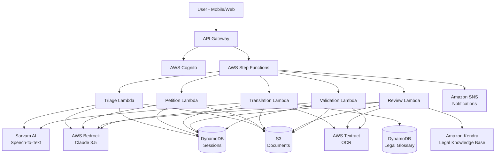
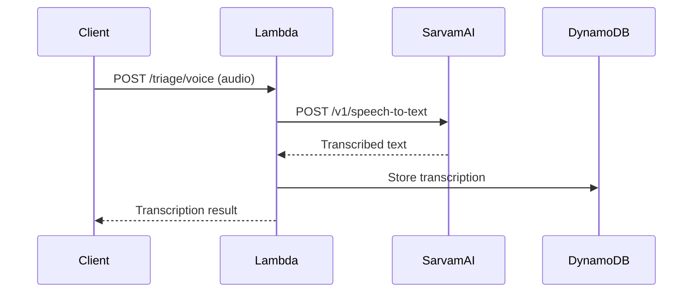
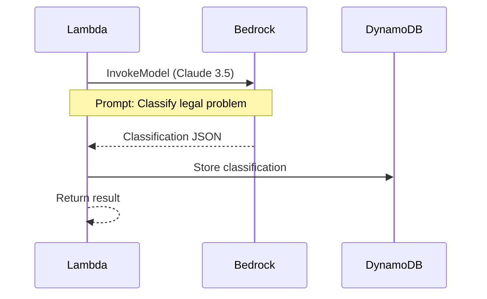
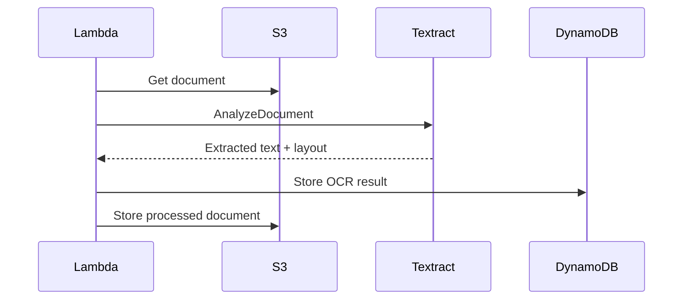
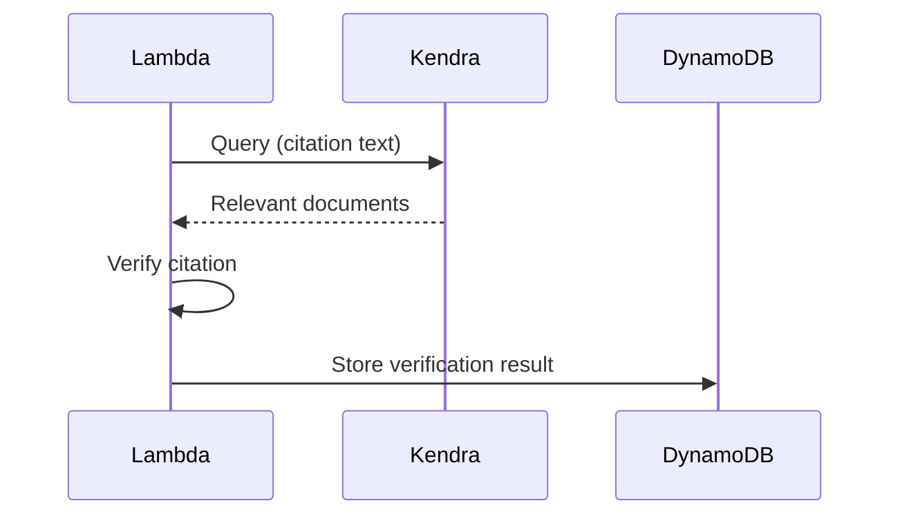
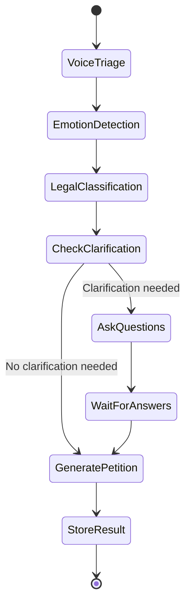

# Design Document: Nyaya-Dwarpal AI Agent
## Digital Legal First-Responder

## Overview

Nyaya-Dwarpal is a voice-first, multilingual legal assistance system that democratizes access to justice in India. The system acts as a "Digital Legal First-Responder" helping rural citizens and party-in-person litigants navigate the Indian legal system through five core capabilities:

1. **Vernacular Voice-to-Legal Triage**: Speech-to-text processing with emotion detection and legal classification
2. **Smart Petition Architect**: Conversational petition generation with structured legal formatting
3. **Vernacular-to-English Document Converter**: OCR-based translation with legal glossary mapping
4. **Legal Sanity Reviewer**: Citation extraction and verification against current legal databases
5. **e-Filing Readiness Check**: Comprehensive document validation for e-Courts compliance

The system leverages AWS AI services (Bedrock, Textract, Kendra) and Sarvam AI for Indic language processing to transform spoken grievances into court-ready legal documents while ensuring procedural compliance.

### Design Goals

- **Accessibility**: Enable legal access for non-English speakers and rural populations
- **Accuracy**: Ensure legal classifications and citations are correct and up-to-date
- **Simplicity**: Provide conversational, non-technical interactions
- **Compliance**: Generate documents that meet e-Courts filing standards
- **Performance**: Respond within seconds to maintain conversational flow
- **Security**: Protect sensitive legal information with encryption and access controls

## Architecture

### High-Level Architecture





### Architecture Principles

1. **Serverless-First**: Use AWS Lambda for compute to enable auto-scaling and cost optimization
2. **Event-Driven**: Orchestrate workflows using Step Functions for complex multi-step processes
3. **Service-Oriented**: Each feature is implemented as an independent service with clear boundaries
4. **API-First**: All functionality exposed through REST APIs for flexibility
5. **Data Isolation**: Separate storage for different data types (documents in S3, metadata in DynamoDB)
6. **Security by Design**: Encryption at rest and in transit, authentication and authorization at every layer

### Component Interaction Flow

**Typical User Journey:**

1. User authenticates via Cognito
2. User speaks grievance → API Gateway → Triage Lambda
3. Triage Lambda calls Sarvam AI (speech-to-text) → Bedrock (classification)
4. Results stored in DynamoDB, user notified
5. User confirms → Petition Lambda generates structured petition
6. Petition stored in S3, metadata in DynamoDB
7. User uploads documents → Translation Lambda processes
8. Translated documents stored in S3
9. User requests review → Review Lambda validates citations
10. User requests readiness check → Validation Lambda checks defects
11. Final package generated and made available for download

## Components and Interfaces

### 1. Vernacular Voice-to-Legal Triage Component

**Purpose**: Convert spoken grievances into structured legal classifications

**Sub-Components:**


- **Voice Capture Handler**: Receives audio streams from client applications
- **Speech-to-Text Processor**: Integrates with Sarvam AI for Indic language transcription
- **Emotion Detector**: Analyzes transcribed text for emotional context and urgency
- **Legal Classifier**: Uses Bedrock to extract facts and classify legal categories
- **Section Mapper**: Maps problems to specific BNS/BNSS/CPC sections

**Interfaces:**

```typescript
// Input
interface VoiceTriageRequest {
  userId: string;
  sessionId: string;
  audioData: Buffer;
  language: string; // ISO 639-1 code (hi, ta, kn, etc.)
  audioFormat: 'wav' | 'mp3' | 'ogg';
}

// Output
interface VoiceTriageResponse {
  sessionId: string;
  transcription: string;
  emotion: {
    primary: 'distressed' | 'angry' | 'confused' | 'neutral';
    confidence: number;
    urgency: 'high' | 'medium' | 'low';
  };
  classification: {
    category: 'Civil' | 'Criminal' | 'Consumer' | 'Family' | 'Property' | 'Labour' | 'Other';
    subCategory: string;
    confidence: number;
    relevantSections: Array<{
      act: 'BNS' | 'BNSS' | 'CPC' | 'IPC' | 'CrPC';
      section: string;
      description: string;
    }>;
    severity: 'high' | 'medium' | 'low';
  };
  extractedFacts: {
    who: string[];
    what: string;
    when: string;
    where: string;
    why: string;
  };
  timestamp: string;
}
```

**Integration Points:**

- **Sarvam AI API**: POST /v1/speech-to-text
  - Input: Audio buffer, language code
  - Output: Transcribed text
  - Timeout: 5 seconds
  
- **AWS Bedrock (Claude 3.5)**: InvokeModel API
  - Input: Transcribed text + legal classification prompt
  - Output: Structured JSON with classification
  - Timeout: 10 seconds


### 2. Smart Petition Architect Component

**Purpose**: Generate structured legal petitions from user narratives with conversational clarification

**Sub-Components:**

- **Petition Generator**: Creates structured petitions (Facts, Grounds, Prayer)
- **Clarification Engine**: Identifies missing information and generates questions
- **Template Manager**: Maintains petition templates for different case types
- **Procedural Validator**: Ensures all required clauses and formatting are present

**Interfaces:**

```typescript
// Input
interface PetitionGenerationRequest {
  userId: string;
  sessionId: string;
  triageData: VoiceTriageResponse;
  additionalContext?: Record<string, any>;
  language: string;
}

// Output
interface PetitionGenerationResponse {
  sessionId: string;
  petition: {
    title: string;
    facts: {
      chronology: Array<{
        date: string;
        event: string;
        parties: string[];
      }>;
      summary: string;
    };
    grounds: {
      legalBasis: Array<{
        provision: string;
        act: string;
        section: string;
        relevance: string;
      }>;
      arguments: string[];
    };
    prayer: {
      reliefSought: string[];
      specificReliefs: Array<{
        type: 'monetary' | 'injunction' | 'possession' | 'declaration' | 'other';
        description: string;
        amount?: number;
      }>;
    };
    verification: string;
    formatting: {
      compliant: boolean;
      issues: string[];
    };
  };
  clarificationNeeded: boolean;
  clarificationQuestions?: Array<{
    id: string;
    question: string;
    type: 'date' | 'amount' | 'name' | 'location' | 'text';
    required: boolean;
  }>;
  status: 'draft' | 'pending_clarification' | 'ready';
}
```


**Integration Points:**

- **AWS Bedrock (Claude 3.5)**: InvokeModel API
  - Input: Triage data + petition generation prompt
  - Output: Structured petition JSON
  - Timeout: 30 seconds

- **Sarvam AI Translation**: POST /v1/translate
  - Input: Generated petition (English), target language
  - Output: Translated petition
  - Timeout: 10 seconds

### 3. Vernacular-to-English Document Converter Component

**Purpose**: Translate regional language documents to court-standard English with legal accuracy

**Sub-Components:**

- **OCR Processor**: Extracts text from scanned documents
- **Translation Engine**: Translates extracted text using Sarvam AI
- **Legal Glossary Mapper**: Ensures legal terms are translated correctly
- **Format Preserver**: Maintains document structure and layout

**Interfaces:**

```typescript
// Input
interface DocumentTranslationRequest {
  userId: string;
  sessionId: string;
  documentId: string;
  sourceLanguage: string;
  documentType: 'FIR' | 'Deed' | 'Notice' | 'Affidavit' | 'Other';
  s3Key: string;
}

// Output
interface DocumentTranslationResponse {
  sessionId: string;
  documentId: string;
  originalText: string;
  translatedText: string;
  glossaryMappings: Array<{
    originalTerm: string;
    translatedTerm: string;
    context: string;
    confidence: number;
  }>;
  unmappedTerms: Array<{
    term: string;
    literalTranslation: string;
    needsReview: boolean;
  }>;
  translatedDocumentS3Key: string;
  quality: {
    ocrConfidence: number;
    translationConfidence: number;
    structurePreserved: boolean;
  };
  status: 'completed' | 'needs_review';
}
```


**Integration Points:**

- **AWS Textract**: AnalyzeDocument API
  - Input: S3 document key
  - Output: Extracted text with layout information
  - Timeout: 15 seconds per document

- **Sarvam AI Translation**: POST /v1/translate
  - Input: Extracted text, source language, target language (English)
  - Output: Translated text
  - Timeout: 10 seconds

- **DynamoDB Legal Glossary**: Query operation
  - Input: Term, source language
  - Output: Legal equivalent in English
  - Timeout: 1 second

### 4. Legal Sanity Reviewer Component

**Purpose**: Verify legal citations and flag outdated or fake references

**Sub-Components:**

- **Citation Extractor**: Identifies all legal citations in documents
- **Citation Verifier**: Cross-references citations against legal databases
- **Update Mapper**: Maps outdated citations to current equivalents
- **Report Generator**: Creates comprehensive review reports

**Interfaces:**

```typescript
// Input
interface CitationReviewRequest {
  userId: string;
  sessionId: string;
  documentId: string;
  documentType: 'petition' | 'affidavit' | 'written_statement' | 'other';
  s3Key: string;
}

// Output
interface CitationReviewResponse {
  sessionId: string;
  documentId: string;
  citations: {
    statutory: Array<{
      original: string;
      act: string;
      section: string;
      status: 'valid' | 'outdated' | 'invalid' | 'ambiguous';
      suggestion?: string;
      reason?: string;
    }>;
    caselaw: Array<{
      citation: string;
      caseName: string;
      court: string;
      year: string;
      status: 'verified' | 'not_found' | 'overruled' | 'needs_verification';
      relevance?: string;
      kendraDocumentId?: string;
    }>;
  };
  issues: Array<{
    type: 'outdated_citation' | 'fake_citation' | 'incorrect_format' | 'missing_citation';
    severity: 'high' | 'medium' | 'low';
    location: string;
    description: string;
    suggestion: string;
  }>;
  summary: {
    totalCitations: number;
    validCitations: number;
    outdatedCitations: number;
    invalidCitations: number;
    overallScore: number; // 0-100
  };
  status: 'passed' | 'needs_revision';
}
```


**Integration Points:**

- **AWS Textract**: AnalyzeDocument API
  - Input: S3 document key
  - Output: Extracted text
  - Timeout: 15 seconds

- **Amazon Kendra**: Query API
  - Input: Citation text
  - Output: Relevant legal documents
  - Timeout: 5 seconds per query

- **AWS Bedrock (Claude 3.5)**: InvokeModel API
  - Input: Extracted citations + verification prompt
  - Output: Citation analysis
  - Timeout: 10 seconds

### 5. e-Filing Readiness Check Component

**Purpose**: Validate documents for e-Courts compliance and detect defects

**Sub-Components:**

- **Document Analyzer**: Examines document quality and formatting
- **Signature Detector**: Identifies missing or invalid signatures
- **Margin Validator**: Checks margin compliance with e-Courts specifications
- **Completeness Checker**: Verifies all required documents and information
- **Readiness Reporter**: Generates comprehensive validation reports

**Interfaces:**

```typescript
// Input
interface FilingReadinessRequest {
  userId: string;
  sessionId: string;
  caseType: string;
  documents: Array<{
    documentId: string;
    documentType: string;
    s3Key: string;
    required: boolean;
  }>;
  metadata: {
    courtFee: number;
    paymentProof?: string;
    jurisdiction: string;
  };
}

// Output
interface FilingReadinessResponse {
  sessionId: string;
  readinessScore: number; // 0-100
  status: 'ready' | 'needs_fixes' | 'incomplete';
  documentChecks: Array<{
    documentId: string;
    documentType: string;
    checks: {
      signaturePresent: boolean;
      qualityAcceptable: boolean;
      marginsCorrect: boolean;
      pageNumbersPresent: boolean;
      formattingCorrect: boolean;
    };
    defects: Array<{
      type: 'missing_signature' | 'blurry_scan' | 'incorrect_margins' | 'missing_pages' | 'formatting_error';
      severity: 'critical' | 'major' | 'minor';
      description: string;
      remediation: string;
    }>;
  }>;
  completenessChecks: {
    mandatoryDocumentsPresent: boolean;
    courtFeeCalculated: boolean;
    paymentProofAttached: boolean;
    signaturesComplete: boolean;
    jurisdictionCorrect: boolean;
    citationsValid: boolean;
  };
  checklist: Array<{
    item: string;
    status: 'complete' | 'incomplete' | 'needs_review';
    action?: string;
  }>;
  certificate?: {
    issued: boolean;
    certificateId: string;
    issuedAt: string;
  };
}
```


**Integration Points:**

- **AWS Textract**: AnalyzeDocument API with FORMS and TABLES analysis
  - Input: S3 document keys
  - Output: Document structure, text, and quality metrics
  - Timeout: 15 seconds per document

- **AWS Bedrock (Claude 3.5)**: InvokeModel API
  - Input: Document analysis + validation rules
  - Output: Defect identification and recommendations
  - Timeout: 10 seconds

### 6. Session Management Component

**Purpose**: Maintain user session state across multi-step workflows

**Interfaces:**

```typescript
interface Session {
  sessionId: string;
  userId: string;
  createdAt: string;
  updatedAt: string;
  expiresAt: string;
  language: string;
  currentStep: 'triage' | 'petition' | 'translation' | 'review' | 'validation' | 'complete';
  data: {
    triageResult?: VoiceTriageResponse;
    petitionDraft?: PetitionGenerationResponse;
    translatedDocuments?: DocumentTranslationResponse[];
    reviewResults?: CitationReviewResponse[];
    readinessCheck?: FilingReadinessResponse;
  };
  metadata: {
    deviceType: string;
    ipAddress: string;
    userAgent: string;
  };
}
```

### 7. Notification Component

**Purpose**: Send notifications to users about case updates and reminders

**Interfaces:**

```typescript
interface NotificationRequest {
  userId: string;
  type: 'sms' | 'email' | 'push';
  template: string;
  data: Record<string, any>;
  language: string;
}

interface NotificationResponse {
  notificationId: string;
  status: 'sent' | 'failed' | 'queued';
  timestamp: string;
}
```


## Data Models

### User Model

```typescript
interface User {
  userId: string; // Primary Key
  phoneNumber: string;
  email?: string;
  name: string;
  preferredLanguage: string;
  createdAt: string;
  lastLoginAt: string;
  profile: {
    state: string;
    district: string;
    pincode: string;
    isLawyer: boolean;
  };
  settings: {
    notificationsEnabled: boolean;
    smsEnabled: boolean;
    emailEnabled: boolean;
  };
  status: 'active' | 'suspended' | 'deleted';
}
```

**DynamoDB Table: Users**
- Primary Key: userId (String)
- GSI: phoneNumber-index (for login lookup)
- TTL: Not applicable (permanent records)

### Session Model

```typescript
interface Session {
  sessionId: string; // Primary Key
  userId: string; // GSI
  createdAt: string;
  updatedAt: string;
  expiresAt: string; // TTL attribute
  language: string;
  currentStep: 'triage' | 'petition' | 'translation' | 'review' | 'validation' | 'complete';
  data: {
    triageResult?: object;
    petitionDraft?: object;
    translatedDocuments?: object[];
    reviewResults?: object[];
    readinessCheck?: object;
  };
  metadata: {
    deviceType: string;
    ipAddress: string;
    userAgent: string;
  };
}
```

**DynamoDB Table: Sessions**
- Primary Key: sessionId (String)
- GSI: userId-createdAt-index (for user session history)
- TTL: expiresAt (auto-delete after 90 days)


### Petition Model

```typescript
interface Petition {
  petitionId: string; // Primary Key
  userId: string; // GSI
  sessionId: string;
  createdAt: string;
  updatedAt: string;
  status: 'draft' | 'pending_clarification' | 'ready' | 'filed' | 'archived';
  caseType: string;
  classification: {
    category: string;
    subCategory: string;
    relevantSections: Array<{
      act: string;
      section: string;
      description: string;
    }>;
  };
  content: {
    title: string;
    facts: object;
    grounds: object;
    prayer: object;
    verification: string;
  };
  documents: Array<{
    documentId: string;
    documentType: string;
    s3Key: string;
    uploadedAt: string;
  }>;
  filingDetails?: {
    caseNumber: string;
    filingDate: string;
    court: string;
    nextHearingDate?: string;
  };
  s3Key: string; // Final petition PDF
}
```

**DynamoDB Table: Petitions**
- Primary Key: petitionId (String)
- GSI: userId-createdAt-index (for user petition history)
- GSI: status-index (for filtering by status)

### Document Model

```typescript
interface Document {
  documentId: string; // Primary Key
  userId: string; // GSI
  sessionId: string;
  petitionId?: string;
  createdAt: string;
  updatedAt: string;
  documentType: 'FIR' | 'Deed' | 'Notice' | 'Affidavit' | 'Petition' | 'Other';
  originalLanguage: string;
  originalS3Key: string;
  translatedS3Key?: string;
  ocrText?: string;
  translatedText?: string;
  metadata: {
    fileSize: number;
    mimeType: string;
    pageCount: number;
    ocrConfidence?: number;
    translationConfidence?: number;
  };
  status: 'uploaded' | 'processing' | 'translated' | 'reviewed' | 'validated' | 'failed';
  defects?: Array<{
    type: string;
    severity: string;
    description: string;
  }>;
}
```

**DynamoDB Table: Documents**
- Primary Key: documentId (String)
- GSI: userId-createdAt-index (for user document history)
- GSI: petitionId-index (for petition documents)


### Legal Glossary Model

```typescript
interface GlossaryEntry {
  termId: string; // Primary Key
  sourceLanguage: string; // Sort Key
  sourceTerm: string;
  englishEquivalent: string;
  legalContext: string;
  examples: string[];
  category: 'procedural' | 'substantive' | 'documentary' | 'general';
  verified: boolean;
  verifiedBy?: string;
  createdAt: string;
  updatedAt: string;
  usageCount: number;
}
```

**DynamoDB Table: LegalGlossary**
- Primary Key: termId (String)
- Sort Key: sourceLanguage (String)
- GSI: sourceTerm-sourceLanguage-index (for term lookup)
- GSI: category-index (for browsing by category)

### Citation Model

```typescript
interface Citation {
  citationId: string; // Primary Key
  type: 'statutory' | 'caselaw';
  act?: string; // For statutory citations
  section?: string;
  caseName?: string; // For case law
  citation?: string;
  court?: string;
  year?: string;
  status: 'valid' | 'outdated' | 'overruled' | 'invalid';
  replacedBy?: string; // For outdated citations
  kendraDocumentId?: string;
  fullText?: string;
  summary?: string;
  createdAt: string;
  updatedAt: string;
  verificationCount: number;
  lastVerifiedAt: string;
}
```

**DynamoDB Table: Citations**
- Primary Key: citationId (String)
- GSI: act-section-index (for statutory lookup)
- GSI: caseName-index (for case law lookup)
- GSI: status-index (for filtering valid citations)


### Case Tracking Model

```typescript
interface CaseTracking {
  trackingId: string; // Primary Key
  userId: string; // GSI
  petitionId: string;
  caseNumber: string;
  court: string;
  filingDate: string;
  status: 'filed' | 'pending' | 'hearing_scheduled' | 'disposed' | 'withdrawn';
  hearingDates: Array<{
    date: string;
    purpose: string;
    outcome?: string;
  }>;
  nextHearingDate?: string;
  lastUpdated: string;
  notifications: Array<{
    type: string;
    sentAt: string;
    status: string;
  }>;
}
```

**DynamoDB Table: CaseTracking**
- Primary Key: trackingId (String)
- GSI: userId-index (for user case lookup)
- GSI: caseNumber-index (for case number lookup)
- GSI: nextHearingDate-index (for reminder scheduling)

### Audit Log Model

```typescript
interface AuditLog {
  logId: string; // Primary Key
  timestamp: string; // Sort Key
  userId: string;
  action: string;
  resource: string;
  resourceId: string;
  details: object;
  ipAddress: string;
  userAgent: string;
  status: 'success' | 'failure';
  errorMessage?: string;
}
```

**DynamoDB Table: AuditLogs**
- Primary Key: logId (String)
- Sort Key: timestamp (String)
- GSI: userId-timestamp-index (for user activity history)
- GSI: resource-timestamp-index (for resource access history)
- TTL: Set to 180 days from timestamp


### S3 Storage Structure

```
nyaya-dwarpal-documents/
├── users/
│   └── {userId}/
│       ├── audio/
│       │   └── {sessionId}/
│       │       └── {timestamp}.wav
│       ├── documents/
│       │   └── {documentId}/
│       │       ├── original.pdf
│       │       └── translated.pdf
│       └── petitions/
│           └── {petitionId}/
│               ├── draft.pdf
│               ├── final.pdf
│               └── attachments/
│                   └── {documentId}.pdf
└── temp/
    └── {sessionId}/
        └── {filename}
```

**S3 Bucket Configuration:**
- Encryption: AES-256 (SSE-S3)
- Versioning: Enabled
- Lifecycle Policy: Move to Glacier after 90 days, delete after 365 days
- Access: Private (IAM role-based access only)

## API Specifications

### Authentication

All API endpoints require authentication via AWS Cognito JWT tokens.

**Headers:**
```
Authorization: Bearer {jwt_token}
Content-Type: application/json
Accept-Language: {language_code}
```

### REST API Endpoints

#### 1. Voice Triage API

**POST /api/v1/triage/voice**

Request:
```json
{
  "sessionId": "string",
  "audioData": "base64_encoded_audio",
  "language": "hi",
  "audioFormat": "wav"
}
```

Response:
```json
{
  "sessionId": "string",
  "transcription": "string",
  "emotion": {
    "primary": "distressed",
    "confidence": 0.85,
    "urgency": "high"
  },
  "classification": {
    "category": "Criminal",
    "subCategory": "Theft",
    "confidence": 0.92,
    "relevantSections": [
      {
        "act": "BNS",
        "section": "303",
        "description": "Theft"
      }
    ],
    "severity": "medium"
  },
  "extractedFacts": {
    "who": ["Accused Name"],
    "what": "Theft of mobile phone",
    "when": "2024-01-15",
    "where": "Bangalore",
    "why": "Unknown"
  }
}
```


#### 2. Petition Generation API

**POST /api/v1/petition/generate**

Request:
```json
{
  "sessionId": "string",
  "triageData": {
    "classification": {},
    "extractedFacts": {}
  },
  "additionalContext": {},
  "language": "hi"
}
```

Response:
```json
{
  "sessionId": "string",
  "petitionId": "string",
  "petition": {
    "title": "string",
    "facts": {},
    "grounds": {},
    "prayer": {}
  },
  "clarificationNeeded": true,
  "clarificationQuestions": [
    {
      "id": "q1",
      "question": "What is the exact date of incident?",
      "type": "date",
      "required": true
    }
  ],
  "status": "pending_clarification"
}
```

**POST /api/v1/petition/clarify**

Request:
```json
{
  "sessionId": "string",
  "petitionId": "string",
  "answers": [
    {
      "questionId": "q1",
      "answer": "2024-01-15"
    }
  ]
}
```

Response:
```json
{
  "petitionId": "string",
  "petition": {},
  "clarificationNeeded": false,
  "status": "ready"
}
```

#### 3. Document Translation API

**POST /api/v1/translate/document**

Request:
```json
{
  "sessionId": "string",
  "documentId": "string",
  "sourceLanguage": "kn",
  "documentType": "FIR",
  "s3Key": "string"
}
```

Response:
```json
{
  "documentId": "string",
  "originalText": "string",
  "translatedText": "string",
  "glossaryMappings": [
    {
      "originalTerm": "ಖಾತಾ",
      "translatedTerm": "Land Revenue Record",
      "context": "Property documentation",
      "confidence": 0.95
    }
  ],
  "unmappedTerms": [],
  "translatedDocumentS3Key": "string",
  "quality": {
    "ocrConfidence": 0.92,
    "translationConfidence": 0.88,
    "structurePreserved": true
  },
  "status": "completed"
}
```


#### 4. Citation Review API

**POST /api/v1/review/citations**

Request:
```json
{
  "sessionId": "string",
  "documentId": "string",
  "documentType": "petition",
  "s3Key": "string"
}
```

Response:
```json
{
  "documentId": "string",
  "citations": {
    "statutory": [
      {
        "original": "IPC Section 379",
        "act": "IPC",
        "section": "379",
        "status": "outdated",
        "suggestion": "BNS Section 303",
        "reason": "IPC replaced by BNS in 2023"
      }
    ],
    "caselaw": [
      {
        "citation": "AIR 2020 SC 1234",
        "caseName": "State v. Accused",
        "court": "Supreme Court",
        "year": "2020",
        "status": "verified",
        "relevance": "Directly applicable",
        "kendraDocumentId": "doc123"
      }
    ]
  },
  "issues": [
    {
      "type": "outdated_citation",
      "severity": "high",
      "location": "Page 3, Para 2",
      "description": "IPC Section 379 is outdated",
      "suggestion": "Replace with BNS Section 303"
    }
  ],
  "summary": {
    "totalCitations": 5,
    "validCitations": 3,
    "outdatedCitations": 2,
    "invalidCitations": 0,
    "overallScore": 60
  },
  "status": "needs_revision"
}
```

#### 5. Filing Readiness API

**POST /api/v1/filing/readiness**

Request:
```json
{
  "sessionId": "string",
  "caseType": "Criminal",
  "documents": [
    {
      "documentId": "doc1",
      "documentType": "petition",
      "s3Key": "string",
      "required": true
    }
  ],
  "metadata": {
    "courtFee": 500,
    "paymentProof": "s3_key",
    "jurisdiction": "Bangalore"
  }
}
```


Response:
```json
{
  "sessionId": "string",
  "readinessScore": 85,
  "status": "ready",
  "documentChecks": [
    {
      "documentId": "doc1",
      "documentType": "petition",
      "checks": {
        "signaturePresent": true,
        "qualityAcceptable": true,
        "marginsCorrect": true,
        "pageNumbersPresent": true,
        "formattingCorrect": true
      },
      "defects": []
    }
  ],
  "completenessChecks": {
    "mandatoryDocumentsPresent": true,
    "courtFeeCalculated": true,
    "paymentProofAttached": true,
    "signaturesComplete": true,
    "jurisdictionCorrect": true,
    "citationsValid": true
  },
  "checklist": [
    {
      "item": "Petition signed",
      "status": "complete"
    },
    {
      "item": "Court fee paid",
      "status": "complete"
    }
  ],
  "certificate": {
    "issued": true,
    "certificateId": "cert123",
    "issuedAt": "2024-01-20T10:30:00Z"
  }
}
```

#### 6. Session Management API

**GET /api/v1/session/{sessionId}**

Response:
```json
{
  "sessionId": "string",
  "userId": "string",
  "currentStep": "petition",
  "data": {},
  "createdAt": "2024-01-20T10:00:00Z",
  "updatedAt": "2024-01-20T10:30:00Z"
}
```

**DELETE /api/v1/session/{sessionId}**

Response:
```json
{
  "message": "Session deleted successfully"
}
```


#### 7. Case Tracking API

**GET /api/v1/cases/{caseNumber}**

Response:
```json
{
  "caseNumber": "string",
  "court": "string",
  "status": "hearing_scheduled",
  "nextHearingDate": "2024-02-15",
  "hearingDates": [
    {
      "date": "2024-01-25",
      "purpose": "First hearing",
      "outcome": "Adjourned"
    }
  ],
  "lastUpdated": "2024-01-25T15:00:00Z"
}
```

**GET /api/v1/cases/user/{userId}**

Response:
```json
{
  "cases": [
    {
      "caseNumber": "string",
      "court": "string",
      "status": "pending",
      "filingDate": "2024-01-20",
      "nextHearingDate": "2024-02-15"
    }
  ]
}
```

## Integration Patterns

### 1. Sarvam AI Integration

**Speech-to-Text Flow:**



**Configuration:**
- Endpoint: https://api.sarvam.ai/v1/speech-to-text
- Authentication: API Key in header
- Retry Policy: 3 attempts with exponential backoff
- Timeout: 5 seconds
- Supported Languages: 22+ Indian languages


### 2. AWS Bedrock Integration

**Legal Classification Flow:**



**Configuration:**
- Model: anthropic.claude-3-5-sonnet-20241022-v2:0
- Region: us-east-1
- Max Tokens: 4096
- Temperature: 0.3 (for consistency)
- Retry Policy: 3 attempts with exponential backoff
- Timeout: 30 seconds

**Prompt Engineering:**

For Legal Triage:
```
You are a legal expert in Indian law. Analyze the following grievance and provide:
1. Legal category (Civil/Criminal/Consumer/Family/Property/Labour)
2. Sub-category
3. Relevant BNS/BNSS/CPC sections
4. Severity level
5. Key facts (who, what, when, where, why)

Grievance: {transcribed_text}

Respond in JSON format.
```

For Petition Generation:
```
You are a legal drafter. Generate a structured petition with:
1. Facts section (chronological, with dates and parties)
2. Grounds section (legal provisions and arguments)
3. Prayer section (relief sought)
4. Verification statement

Classification: {classification_data}
Facts: {extracted_facts}

Respond in JSON format following Indian legal petition structure.
```


### 3. AWS Textract Integration

**Document Analysis Flow:**



**Configuration:**
- API: AnalyzeDocument
- Features: FORMS, TABLES, SIGNATURES
- Retry Policy: 3 attempts
- Timeout: 15 seconds per document
- Max Document Size: 10 MB

**Quality Thresholds:**
- OCR Confidence: > 85% (acceptable)
- Signature Detection: > 90% (required)
- Layout Preservation: > 80% (acceptable)

### 4. Amazon Kendra Integration

**Citation Verification Flow:**



**Configuration:**
- Index: legal-knowledge-base
- Data Sources: 
  - BNS/BNSS/CPC/IPC statutory texts
  - Supreme Court judgments
  - High Court judgments
- Query Capacity: 10 queries per second
- Timeout: 5 seconds per query

**Knowledge Base Structure:**
- Statutory Laws: Organized by Act → Section
- Case Law: Organized by Court → Year → Citation
- Metadata: Status (valid/outdated/overruled), effective dates


### 5. AWS Step Functions Orchestration

**Petition Generation Workflow:**



**State Machine Definition:**
```json
{
  "Comment": "Petition Generation Workflow",
  "StartAt": "VoiceTriage",
  "States": {
    "VoiceTriage": {
      "Type": "Task",
      "Resource": "arn:aws:lambda:region:account:function:triage",
      "Next": "EmotionDetection",
      "Catch": [{
        "ErrorEquals": ["States.ALL"],
        "Next": "HandleError"
      }]
    },
    "EmotionDetection": {
      "Type": "Task",
      "Resource": "arn:aws:lambda:region:account:function:emotion",
      "Next": "LegalClassification"
    },
    "LegalClassification": {
      "Type": "Task",
      "Resource": "arn:aws:lambda:region:account:function:classify",
      "Next": "CheckClarification"
    },
    "CheckClarification": {
      "Type": "Choice",
      "Choices": [{
        "Variable": "$.clarificationNeeded",
        "BooleanEquals": true,
        "Next": "AskQuestions"
      }],
      "Default": "GeneratePetition"
    },
    "AskQuestions": {
      "Type": "Task",
      "Resource": "arn:aws:states:::lambda:invoke.waitForTaskToken",
      "Next": "GeneratePetition"
    },
    "GeneratePetition": {
      "Type": "Task",
      "Resource": "arn:aws:lambda:region:account:function:petition",
      "Next": "StoreResult"
    },
    "StoreResult": {
      "Type": "Task",
      "Resource": "arn:aws:lambda:region:account:function:store",
      "End": true
    },
    "HandleError": {
      "Type": "Fail",
      "Error": "WorkflowFailed",
      "Cause": "An error occurred in the workflow"
    }
  }
}
```


## Error Handling

### Error Categories

1. **Client Errors (4xx)**
   - 400 Bad Request: Invalid input data
   - 401 Unauthorized: Missing or invalid authentication
   - 403 Forbidden: Insufficient permissions
   - 404 Not Found: Resource not found
   - 429 Too Many Requests: Rate limit exceeded

2. **Server Errors (5xx)**
   - 500 Internal Server Error: Unexpected server error
   - 502 Bad Gateway: External service failure
   - 503 Service Unavailable: Service temporarily unavailable
   - 504 Gateway Timeout: External service timeout

### Error Response Format

```json
{
  "error": {
    "code": "ERROR_CODE",
    "message": "Human-readable error message",
    "details": {
      "field": "Specific field that caused error",
      "reason": "Detailed reason"
    },
    "requestId": "unique-request-id",
    "timestamp": "2024-01-20T10:30:00Z"
  }
}
```

### Error Handling Strategies

#### 1. External Service Failures

**Sarvam AI Failure:**
- Retry: 3 attempts with exponential backoff (1s, 2s, 4s)
- Fallback: Prompt user to type text instead of voice
- Logging: Log failure details for monitoring

**AWS Bedrock Failure:**
- Retry: 3 attempts with exponential backoff
- Fallback: Use cached classification for similar grievances
- Circuit Breaker: Stop requests after 5 consecutive failures for 60 seconds

**AWS Textract Failure:**
- Retry: 3 attempts
- Fallback: Prompt user to re-upload clearer document
- Manual Review: Flag for human review if OCR confidence < 70%

**Amazon Kendra Failure:**
- Retry: 2 attempts
- Fallback: Use local citation database
- Degraded Mode: Mark citations as "needs manual verification"


#### 2. Data Validation Errors

**Invalid Audio Format:**
- Response: 400 Bad Request
- Message: "Unsupported audio format. Please use WAV, MP3, or OGG"
- Action: Client converts format before retry

**Missing Required Fields:**
- Response: 400 Bad Request
- Message: "Missing required field: {field_name}"
- Action: Client provides missing data

**Document Size Exceeded:**
- Response: 413 Payload Too Large
- Message: "Document size exceeds 10 MB limit"
- Action: Client compresses or splits document

#### 3. Business Logic Errors

**Insufficient Classification Confidence:**
- Threshold: < 70% confidence
- Action: Ask user to provide more details
- Fallback: Offer manual category selection

**Incomplete Petition Data:**
- Action: Generate clarification questions
- Limit: Maximum 5 questions to avoid user fatigue
- Fallback: Generate partial petition with placeholders

**Citation Not Found:**
- Action: Flag citation as "needs verification"
- Suggestion: Provide similar valid citations
- Manual Review: Queue for legal expert review

#### 4. Rate Limiting

**Per-User Limits:**
- Voice Triage: 10 requests per minute
- Petition Generation: 5 requests per minute
- Document Translation: 20 documents per hour
- Citation Review: 10 requests per hour

**Response:**
```json
{
  "error": {
    "code": "RATE_LIMIT_EXCEEDED",
    "message": "Too many requests. Please try again later.",
    "retryAfter": 60
  }
}
```


#### 5. Timeout Handling

**Service Timeouts:**
- Speech-to-Text: 5 seconds
- Legal Classification: 10 seconds
- Petition Generation: 30 seconds
- Document OCR: 15 seconds per document
- Citation Verification: 5 seconds per query

**Timeout Response:**
```json
{
  "error": {
    "code": "REQUEST_TIMEOUT",
    "message": "Request took too long to process",
    "suggestion": "Please try again or contact support"
  }
}
```

#### 6. Data Consistency

**Session State Management:**
- Optimistic Locking: Use version numbers in DynamoDB
- Conflict Resolution: Last-write-wins with timestamp
- Rollback: Revert to previous state on failure

**Document Upload Failures:**
- Atomic Operations: Upload to S3 and update DynamoDB in transaction
- Cleanup: Delete S3 objects if DynamoDB update fails
- Retry: Allow user to retry upload

### Monitoring and Alerting

**CloudWatch Metrics:**
- API Request Count
- Error Rate (by error type)
- Latency (p50, p95, p99)
- External Service Failures
- DynamoDB Throttling
- Lambda Concurrent Executions

**Alarms:**
- Error Rate > 5%: Warning
- Error Rate > 10%: Critical
- Latency p99 > 5 seconds: Warning
- External Service Failure Rate > 20%: Critical

**Logging:**
- All API requests/responses
- External service calls
- Error stack traces
- User actions (audit trail)


## Security Architecture

### Authentication and Authorization

**AWS Cognito User Pools:**
- User Registration: Phone number + OTP verification
- Login Methods: 
  - Phone + OTP
  - Biometric (fingerprint/face) via device
- Session Management: JWT tokens with 1-hour expiry
- Refresh Tokens: 30-day expiry

**Authorization Model:**
```typescript
enum UserRole {
  CITIZEN = 'citizen',
  LAWYER = 'lawyer',
  ADMIN = 'admin'
}

interface Permissions {
  citizen: [
    'create:petition',
    'read:own_petition',
    'upload:document',
    'read:own_document'
  ];
  lawyer: [
    'create:petition',
    'read:own_petition',
    'read:client_petition',
    'review:citation',
    'upload:document'
  ];
  admin: [
    'read:all_petitions',
    'update:glossary',
    'read:audit_logs',
    'manage:users'
  ];
}
```

### Data Encryption

**At Rest:**
- S3: AES-256 encryption (SSE-S3)
- DynamoDB: AWS KMS encryption
- Secrets: AWS Secrets Manager
- Backups: Encrypted with KMS

**In Transit:**
- TLS 1.3 for all API communications
- Certificate: AWS Certificate Manager
- HTTPS only (HTTP redirects to HTTPS)

### Data Privacy

**PII Protection:**
- Sensitive fields encrypted in DynamoDB
- Audio files deleted after transcription (optional retention)
- User data anonymized in logs
- No PII in CloudWatch logs

**Data Retention:**
- Active Sessions: 90 days
- Completed Petitions: 365 days
- Audit Logs: 180 days
- User Deletion: Complete data removal within 30 days


### Access Control

**IAM Policies:**
- Lambda Execution Roles: Least privilege access
- S3 Bucket Policies: Private by default, role-based access
- DynamoDB: Fine-grained access control
- Secrets Manager: Role-based secret access

**API Gateway:**
- Cognito Authorizer for all endpoints
- Resource Policies: Restrict by IP (optional)
- WAF Rules: 
  - Rate limiting
  - SQL injection protection
  - XSS protection
  - Geographic restrictions (India only)

### Audit and Compliance

**Audit Logging:**
- All API calls logged with user ID, timestamp, action
- Document access tracked
- Data modifications logged
- Failed authentication attempts logged

**Compliance:**
- GDPR: Right to access, right to deletion, data portability
- IT Act 2000: Data protection and privacy
- e-Courts Standards: Document format and security requirements

### Security Best Practices

1. **Input Validation:**
   - Sanitize all user inputs
   - Validate file types and sizes
   - Check for malicious content in uploads

2. **Output Encoding:**
   - Escape HTML in generated documents
   - Sanitize user-provided text in petitions

3. **Secrets Management:**
   - API keys stored in AWS Secrets Manager
   - Automatic rotation every 90 days
   - No hardcoded credentials

4. **Network Security:**
   - Lambda in VPC (for Kendra access)
   - Security Groups: Restrict outbound traffic
   - VPC Endpoints: Private access to AWS services

5. **Vulnerability Management:**
   - Regular dependency updates
   - Automated security scanning
   - Penetration testing quarterly


## Performance Considerations

### Scalability

**Auto-Scaling:**
- Lambda: Automatic scaling up to 1,000 concurrent executions
- DynamoDB: On-demand capacity mode for unpredictable traffic
- API Gateway: Handles 10,000 requests per second
- S3: Unlimited storage and throughput

**Caching:**
- API Gateway: Cache responses for 5 minutes (for static data)
- DynamoDB: DAX for frequently accessed data (glossary, citations)
- CloudFront: CDN for static assets and documents

**Optimization:**
- Lambda: Provisioned concurrency for critical functions (triage, petition)
- DynamoDB: GSI for efficient queries
- S3: Transfer Acceleration for large file uploads
- Bedrock: Batch requests where possible

### Latency Targets

**Response Times:**
- Voice Triage: < 3 seconds (speech-to-text + classification)
- Petition Generation: < 30 seconds
- Document Translation: < 15 seconds per document
- Citation Review: < 10 seconds
- Filing Readiness: < 20 seconds

**Optimization Strategies:**
- Parallel Processing: Run independent tasks concurrently
- Async Operations: Use Step Functions for long-running workflows
- Streaming: Stream large responses to client
- Compression: Gzip compression for API responses

### Cost Optimization

**Resource Management:**
- Lambda: Right-size memory allocation (512 MB - 2 GB)
- DynamoDB: Use on-demand for variable traffic
- S3: Lifecycle policies to move old data to Glacier
- Bedrock: Cache common classifications

**Monitoring:**
- AWS Cost Explorer: Track spending by service
- Budgets: Alert when costs exceed thresholds
- Tagging: Tag resources for cost allocation


## Correctness Properties

*A property is a characteristic or behavior that should hold true across all valid executions of a system—essentially, a formal statement about what the system should do. Properties serve as the bridge between human-readable specifications and machine-verifiable correctness guarantees.*

### Property 1: Speech-to-Text Language Support

*For any* audio input in a supported Indian language, the speech-to-text conversion should return transcribed text in that language.

**Validates: Requirements 1.2**

### Property 2: Emotion Detection Completeness

*For any* transcribed text, emotion detection should return a valid emotion category (distressed, angry, confused, neutral), confidence score, and urgency level (high, medium, low).

**Validates: Requirements 1.3**

### Property 3: Triage Data Persistence Round-Trip

*For any* triage result (transcription + emotion + classification), storing and then retrieving the data should return equivalent values.

**Validates: Requirements 1.4**

### Property 4: Fact Extraction Structure

*For any* transcribed grievance, fact extraction should return a structured object containing who, what, when, where, and why fields.

**Validates: Requirements 2.1**

### Property 5: Legal Classification Validity

*For any* extracted facts, legal classification should return a category from the valid set (Civil, Criminal, Consumer, Family, Property, Labour, Other) with confidence score.

**Validates: Requirements 2.2**


### Property 6: Section Mapping Validity

*For any* legal classification, section mapping should return valid references to BNS, BNSS, CPC, IPC, or CrPC sections.

**Validates: Requirements 2.3**

### Property 7: Severity Level Validity

*For any* legal mapping, severity determination should return one of the valid values (high, medium, low).

**Validates: Requirements 2.4**

### Property 8: Classification Translation

*For any* classification result and target language, the translated output should be in the requested language.

**Validates: Requirements 2.5**

### Property 9: Petition Structure Completeness

*For any* triage result, the generated petition should contain all three required sections: Facts, Grounds, and Prayer.

**Validates: Requirements 3.1**

### Property 10: Facts Chronological Ordering

*For any* petition Facts section with multiple events, the events should be ordered chronologically by date.

**Validates: Requirements 3.2**

### Property 11: Grounds Citation Presence

*For any* petition Grounds section, it should contain at least one valid legal citation (BNS/BNSS/CPC section).

**Validates: Requirements 3.3**

### Property 12: Prayer Relief Specification

*For any* petition Prayer section, it should specify at least one relief type (monetary, injunction, possession, declaration, other).

**Validates: Requirements 3.4**

### Property 13: Petition Procedural Completeness

*For any* generated petition, it should contain all required elements: title, facts, grounds, prayer, and verification statement.

**Validates: Requirements 3.5**


### Property 14: OCR Text Extraction

*For any* uploaded document (petition, FIR, deed, notice, affidavit), OCR should extract text content from the document.

**Validates: Requirements 4.1, 6.1, 7.1**

### Property 15: Document Translation

*For any* extracted text in a regional language, translation should return English text.

**Validates: Requirements 4.2**

### Property 16: Glossary Term Mapping

*For any* legal term that exists in the glossary, translation should use the glossary's English equivalent instead of literal translation.

**Validates: Requirements 4.3, 5.3**

### Property 17: Glossary Lookup for Legal Terms

*For any* identified legal term during translation, the system should query the legal glossary.

**Validates: Requirements 5.2**

### Property 18: Unmapped Term Flagging

*For any* legal term not found in the glossary, the system should use standard translation and flag the term for manual review.

**Validates: Requirements 5.4**

### Property 19: Citation Extraction

*For any* legal document text, citation extraction should identify all statutory citations (BNS, BNSS, IPC, CrPC, CPC) and case law references.

**Validates: Requirements 6.2**

### Property 20: Citation Verification

*For any* identified citation, the system should cross-reference it against the legal database using Kendra.

**Validates: Requirements 6.3**

### Property 21: Outdated Citation Detection

*For any* citation using outdated legal codes (IPC, CrPC), the system should flag it and suggest the current equivalent (BNS, BNSS).

**Validates: Requirements 6.4**


### Property 22: Invalid Citation Detection

*For any* non-existent or fake citation, the system should flag it as potentially hallucinated.

**Validates: Requirements 6.5**

### Property 23: Case Law Verification

*For any* case law citation, the system should verify its existence in the legal database.

**Validates: Requirements 6.6**

### Property 24: Citation Review Report Completeness

*For any* document review, the generated report should include all flagged issues with their severity, location, and suggestions.

**Validates: Requirements 6.7**

### Property 25: Document Defect Detection

*For any* uploaded document, defect detection should check for all defect types: missing signatures, low quality, incorrect margins, missing page numbers, and formatting errors.

**Validates: Requirements 7.2, 7.3, 7.4, 7.5, 7.6**

### Property 26: Defect Report Generation

*For any* document with detected defects, the system should generate a report containing all defects with type, severity, description, and remediation steps.

**Validates: Requirements 7.7**

### Property 27: e-Filing Ready Status

*For any* document with no detected defects, the system should mark it as "e-Filing Ready".

**Validates: Requirements 7.8**

### Property 28: Readiness Check Completeness

*For any* filing package, the readiness check should verify all required aspects: mandatory documents, court fees, payment proof, signatures, jurisdiction, and citations.

**Validates: Requirements 8.2, 8.3, 8.4, 8.5, 8.6**

### Property 29: Readiness Certificate Generation

*For any* filing package that passes all readiness checks, the system should generate an e-Filing Readiness Certificate.

**Validates: Requirements 8.7**


### Property 30: Readiness Checklist Generation

*For any* filing package that fails any readiness check, the system should provide a checklist of items to fix.

**Validates: Requirements 8.8**

### Property 31: Response Translation to User Language

*For any* AI-generated response and user's preferred language, the response should be translated to that language.

**Validates: Requirements 9.2**

### Property 32: Clarification Question Translation

*For any* clarifying question and user's preferred language, the question should be presented in that language.

**Validates: Requirements 9.3**

### Property 33: Bilingual Legal Term Display

*For any* legal term displayed to the user, both the English term and vernacular explanation should be present.

**Validates: Requirements 9.4**

### Property 34: Missing Facts Trigger Questions

*For any* grievance where key facts (who, what, when, where, why) cannot be extracted, the system should generate targeted clarifying questions.

**Validates: Requirements 10.1**

### Property 35: Petition Update with Answers

*For any* clarifying question answer provided by the user, the petition should be updated to incorporate that information.

**Validates: Requirements 10.3**

### Property 36: Critical Information Validation

*For any* petition missing critical information (dates, amounts, names), the system should prompt the user before proceeding.

**Validates: Requirements 10.4**

### Property 37: Question Count Limit

*For any* petition generation session, the system should ask no more than 5 clarifying questions.

**Validates: Requirements 10.5**


### Property 38: Petition Auto-Save

*For any* petition being created, the system should automatically save the draft to storage.

**Validates: Requirements 11.1**

### Property 39: Session Restoration Round-Trip

*For any* saved session, retrieving the session should restore the user to the same state (current step and data).

**Validates: Requirements 11.2**

### Property 40: Document Encryption in Storage

*For any* uploaded document, it should be stored in S3 with encryption enabled.

**Validates: Requirements 11.3**

### Property 41: Filing Package Completeness

*For any* completed filing, the downloadable package should include all associated documents (petition and attachments).

**Validates: Requirements 11.4**

### Property 42: Case Data Persistence

*For any* filed case, the system should store the case number and filing date.

**Validates: Requirements 12.1**

### Property 43: e-Courts API Query

*For any* case status check, the system should query the e-Courts API for updates.

**Validates: Requirements 12.2**

### Property 44: Hearing Date Notifications

*For any* scheduled hearing date, the system should send notifications via SMS and app notification.

**Validates: Requirements 12.3**

### Property 45: Status Change Explanations

*For any* case status change, the system should provide a plain-language explanation.

**Validates: Requirements 12.4**


### Property 46: Audit Logging

*For any* data access operation, the system should create an audit log entry with user ID, action, resource, and timestamp.

**Validates: Requirements 14.6**

### Property 47: Offline Voice Recording

*For any* voice recording when offline, the system should store the audio locally.

**Validates: Requirements 15.1**

### Property 48: Offline Petition Viewing

*For any* previously generated petition, it should be viewable when offline.

**Validates: Requirements 15.2**

### Property 49: Operation Queuing When Offline

*For any* operation attempted while offline, the system should queue it for sync when connectivity is restored.

**Validates: Requirements 15.3**

### Property 50: Auto-Sync on Reconnection

*For any* queued operations when connectivity is restored, the system should automatically sync them.

**Validates: Requirements 15.4**

### Property 51: Offline Mode Notification

*For any* offline feature usage, the system should notify the user that they are in offline mode.

**Validates: Requirements 15.5**

### Property 52: Voice Output Availability

*For any* text content displayed to the user, voice output should be available.

**Validates: Requirements 16.2**


## Testing Strategy

### Dual Testing Approach

The system will employ both unit testing and property-based testing to ensure comprehensive coverage:

- **Unit Tests**: Verify specific examples, edge cases, error conditions, and integration points
- **Property Tests**: Verify universal properties across all inputs through randomized testing

Both approaches are complementary and necessary. Unit tests catch concrete bugs and validate specific scenarios, while property tests verify general correctness across a wide range of inputs.

### Unit Testing

**Focus Areas:**

1. **Specific Examples:**
   - Microphone button activation (Req 1.1)
   - Speech-to-text failure fallback (Req 1.5)
   - Petition presentation to user (Req 3.6)
   - Document download functionality (Req 4.5)
   - Glossary database structure (Req 5.1)
   - Admin glossary management (Req 5.5)
   - Readiness check initiation (Req 8.1)
   - Language support verification (Req 9.5)
   - Encryption configuration (Req 14.1, 14.2)
   - Authentication methods (Req 14.3)
   - User data deletion (Req 14.5)

2. **Edge Cases:**
   - Empty audio input
   - Extremely long transcriptions
   - Documents with no text
   - Citations in unusual formats
   - Documents at size limits
   - Maximum clarification questions (5)

3. **Error Conditions:**
   - Sarvam AI service failures
   - Bedrock timeout scenarios
   - Textract OCR failures
   - Kendra unavailability
   - S3 upload failures
   - DynamoDB throttling
   - Invalid authentication tokens
   - Malformed API requests

4. **Integration Points:**
   - Sarvam AI API integration
   - AWS Bedrock invocation
   - Textract document analysis
   - Kendra query execution
   - S3 upload/download
   - DynamoDB read/write
   - Cognito authentication
   - Step Functions orchestration


### Property-Based Testing

**Testing Library:**
- **Python**: Hypothesis
- **JavaScript/TypeScript**: fast-check
- **Java**: jqwik

**Configuration:**
- Minimum 100 iterations per property test (due to randomization)
- Each test tagged with reference to design document property
- Tag format: `Feature: nyaya-dwarpal, Property {number}: {property_text}`

**Property Test Implementation:**

Each correctness property (1-52) will be implemented as a single property-based test. The tests will:

1. Generate random valid inputs using the testing library's generators
2. Execute the system function under test
3. Assert that the property holds for the generated inputs
4. Report any counterexamples that violate the property

**Example Property Test (Property 1):**

```python
from hypothesis import given, strategies as st
import pytest

@given(
    audio=st.binary(min_size=1000, max_size=100000),
    language=st.sampled_from(['hi', 'ta', 'kn', 'te', 'ml', 'bn', 'mr', 'gu', 'pa', 'or'])
)
@pytest.mark.property_test
def test_speech_to_text_language_support(audio, language):
    """
    Feature: nyaya-dwarpal, Property 1: Speech-to-Text Language Support
    For any audio input in a supported Indian language, 
    the speech-to-text conversion should return transcribed text in that language.
    """
    result = speech_to_text(audio, language)
    
    assert result is not None
    assert isinstance(result, str)
    assert len(result) > 0
    assert detect_language(result) == language
```

**Example Property Test (Property 10):**

```python
from hypothesis import given, strategies as st
import pytest

@given(
    events=st.lists(
        st.fixed_dictionaries({
            'date': st.dates(),
            'event': st.text(min_size=10),
            'parties': st.lists(st.text(min_size=3), min_size=1)
        }),
        min_size=2,
        max_size=10
    )
)
@pytest.mark.property_test
def test_facts_chronological_ordering(events):
    """
    Feature: nyaya-dwarpal, Property 10: Facts Chronological Ordering
    For any petition Facts section with multiple events, 
    the events should be ordered chronologically by date.
    """
    petition = generate_petition_facts(events)
    
    dates = [event['date'] for event in petition['facts']['chronology']]
    assert dates == sorted(dates)
```


**Example Property Test (Property 39):**

```python
from hypothesis import given, strategies as st
import pytest

@given(
    session=st.fixed_dictionaries({
        'sessionId': st.uuids(),
        'userId': st.uuids(),
        'currentStep': st.sampled_from(['triage', 'petition', 'translation', 'review', 'validation']),
        'data': st.dictionaries(st.text(), st.text())
    })
)
@pytest.mark.property_test
def test_session_restoration_round_trip(session):
    """
    Feature: nyaya-dwarpal, Property 39: Session Restoration Round-Trip
    For any saved session, retrieving the session should restore 
    the user to the same state (current step and data).
    """
    # Save session
    save_session(session)
    
    # Retrieve session
    restored = get_session(session['sessionId'])
    
    # Verify round-trip
    assert restored['sessionId'] == session['sessionId']
    assert restored['userId'] == session['userId']
    assert restored['currentStep'] == session['currentStep']
    assert restored['data'] == session['data']
```

### Test Data Generators

**Custom Generators for Domain Objects:**

```python
# Legal classification generator
legal_classification = st.fixed_dictionaries({
    'category': st.sampled_from(['Civil', 'Criminal', 'Consumer', 'Family', 'Property', 'Labour', 'Other']),
    'subCategory': st.text(min_size=5),
    'confidence': st.floats(min_value=0.0, max_value=1.0),
    'relevantSections': st.lists(
        st.fixed_dictionaries({
            'act': st.sampled_from(['BNS', 'BNSS', 'CPC', 'IPC', 'CrPC']),
            'section': st.text(min_size=1, max_size=10),
            'description': st.text(min_size=10)
        }),
        min_size=1,
        max_size=5
    ),
    'severity': st.sampled_from(['high', 'medium', 'low'])
})

# Petition generator
petition = st.fixed_dictionaries({
    'title': st.text(min_size=10),
    'facts': st.fixed_dictionaries({
        'chronology': st.lists(
            st.fixed_dictionaries({
                'date': st.dates(),
                'event': st.text(min_size=10),
                'parties': st.lists(st.text(min_size=3), min_size=1)
            }),
            min_size=1
        ),
        'summary': st.text(min_size=50)
    }),
    'grounds': st.fixed_dictionaries({
        'legalBasis': st.lists(
            st.fixed_dictionaries({
                'provision': st.text(min_size=5),
                'act': st.sampled_from(['BNS', 'BNSS', 'CPC']),
                'section': st.text(min_size=1),
                'relevance': st.text(min_size=10)
            }),
            min_size=1
        ),
        'arguments': st.lists(st.text(min_size=20), min_size=1)
    }),
    'prayer': st.fixed_dictionaries({
        'reliefSought': st.lists(st.text(min_size=10), min_size=1),
        'specificReliefs': st.lists(
            st.fixed_dictionaries({
                'type': st.sampled_from(['monetary', 'injunction', 'possession', 'declaration', 'other']),
                'description': st.text(min_size=10),
                'amount': st.one_of(st.none(), st.integers(min_value=0))
            }),
            min_size=1
        )
    }),
    'verification': st.text(min_size=20)
})

# Citation generator
citation = st.one_of(
    # Statutory citation
    st.fixed_dictionaries({
        'type': st.just('statutory'),
        'act': st.sampled_from(['BNS', 'BNSS', 'CPC', 'IPC', 'CrPC']),
        'section': st.text(min_size=1, max_size=10)
    }),
    # Case law citation
    st.fixed_dictionaries({
        'type': st.just('caselaw'),
        'citation': st.text(min_size=10),
        'caseName': st.text(min_size=10),
        'court': st.sampled_from(['Supreme Court', 'High Court', 'District Court']),
        'year': st.integers(min_value=1950, max_value=2024)
    })
)
```


### Test Coverage Goals

**Unit Test Coverage:**
- Code Coverage: 80%+ line coverage
- Branch Coverage: 75%+ branch coverage
- Integration Tests: All external service integrations

**Property Test Coverage:**
- All 52 correctness properties implemented
- Minimum 100 iterations per property
- Edge case generators for boundary conditions

### Testing Infrastructure

**Test Environment:**
- AWS LocalStack for local AWS service mocking
- Mock Sarvam AI API for speech-to-text and translation
- Mock Bedrock responses for legal classification
- Test DynamoDB tables
- Test S3 buckets
- Test Kendra index with sample legal data

**CI/CD Pipeline:**
1. Run unit tests on every commit
2. Run property tests on every pull request
3. Run integration tests on staging deployment
4. Run performance tests weekly
5. Run security scans daily

**Test Execution:**
- Unit Tests: < 5 minutes
- Property Tests: < 15 minutes
- Integration Tests: < 30 minutes
- Full Test Suite: < 1 hour

### Non-Functional Testing

**Performance Testing:**
- Load testing with 1,000+ concurrent users
- Stress testing to identify breaking points
- Latency testing for all API endpoints
- Throughput testing for document processing

**Security Testing:**
- Penetration testing quarterly
- Vulnerability scanning weekly
- Authentication/authorization testing
- Data encryption verification
- OWASP Top 10 compliance

**Accessibility Testing:**
- Screen reader compatibility (manual)
- Voice navigation testing (manual)
- Keyboard navigation testing
- Color contrast validation
- WCAG 2.1 Level AA compliance (manual verification required)

**Usability Testing:**
- User acceptance testing with target users
- A/B testing for UI improvements
- Feedback collection and analysis
- Task completion rate measurement

---

## Conclusion

This design document provides a comprehensive architecture for the Nyaya-Dwarpal AI Agent, a voice-first, multilingual legal assistance system. The system leverages AWS AI services and Sarvam AI to democratize access to justice in India by helping rural citizens and party-in-person litigants navigate the complex legal system.

The architecture is built on serverless principles for scalability, uses event-driven orchestration for complex workflows, and implements security by design with encryption, authentication, and audit logging. The five core features—Voice Triage, Petition Architect, Document Converter, Citation Reviewer, and Filing Readiness Check—work together to transform spoken grievances into court-ready legal documents.

The design includes 52 correctness properties that will be validated through property-based testing, ensuring the system behaves correctly across all valid inputs. Combined with comprehensive unit testing, integration testing, and non-functional testing, this approach provides high confidence in system correctness and reliability.

